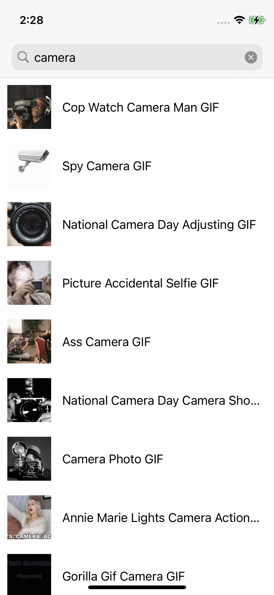

# The Giphy Viewer - MVVM, Coords, RXSwift, SnapKit

A test app that queries the [Giphy API](https://developers.giphy.com/) and displays the results.

## Features
 - Views completely done programmatically
 - Programatic creation of a UICollectionView
 - The usage of a coordinator per `ViewController`
 - A mildly-complex URL architectural system class: `APIPathManager`

### Endpoints
1. Trending
2. Search
3. Get GIF by ID

[<em>more info</em>](https://developers.giphy.com/docs/api/endpoint)

### Dependencies
(<em>Via swift package mgr</em>)
- RxSwift
- AlamoFire for requests (no rx alamofire though)
- ProgressHUD. Simple loading view library
- SnapKit. An easy way to express & manage view constraints
- KingFisher. UIImageView extensions that make it easy to request & cache images

### Architecture
- MVVM + Coordinators

### Project Structure
- ContactList - Root directory
    - Service layer - All the networking classes belong here
    - App Layer - General app classes. App & Scene delegates. App Coordinator
    - Data Layer - Models & data-related classes go here
    - Modules - All user flows are contained here
        - Employees - The employees module. which is the only module of this app
    - Utilities - A place for general utility classes
    - Extensions - A place where generic extensions belong
    - Storyboards - The project's storyboard & LaunchScreen
    - ContactListTests - Unit tests. This is where I tested the Cell's rating label

## Screenshots

